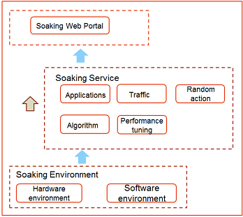
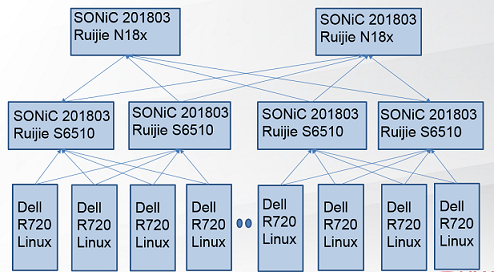

# [Soaking Test HLD] Update soaking\_test.md
soaking-test-hld

# About this Document
This document provides the high level design for the SONiC Soaking Test Method.

# Problem Definition
With the rise of artificial intelligence, high performance computing, distributed storage and other technologies, the performance and stability of data center networks have higher requirements. There are risks in the large-scale deployment of new network hardware and software. Many network operators, such as Ali, Tencent, Baidu and Jingdong, require Ruijie to build a comparable immersion environment in the laboratory to simulate operation drills, discover unknown risks, reproduce online problems and business research.

# Ruijie's Solution

1.Automated Testing,RF Testing,PR Test, Pytest. 
2.Business Modeling, Moving Customer's Field Business to Laboratory. 
3.Soaking Test, the system will run for 7x24 hours under real load to find out long-term problems, such as memory leak, memory rewrite, kernel, resource leak, and measure the stability and reliability of existing network business operation through real business indicators. 

# Soaking Test System Overview
 
__Figure 1: Soaking Test Framework__. 

## Soaking web portal
Used to monitor and manage service and environment

## Soaking service
include five kinds of traffices 
1. Application 
2. Traffic 
3. Random action 
4. Algorithm 
5. Performance Tuning 

## Soaking service applications,indicator,and hardware settings
|	|Application 	|Indicator	|Number of servers |
|:-----:|:-------------:|:-------------:|:----------------:|
|RDMA	|OFED		|Latency 2us,   |20		   |
|	|Ceph Storage	|I/O=300M/S/User|20		   |
|       |TensorFlow     |100% bandwidth |20                |
|       |MPI            |100% bandwidth |20                |
|       |Hadoop RDMA    | 90% bandwidth |20                |
|       |GPU Direct RDMA| 90% bandwidth |20                |
|TCP/IP | Iperf         |100% bandwidth |20                |

## Service Model System
1. Networking Model (RDMA, INT, VSU Lite) 
2. App Model (Big Data, AI, ML) 

## Soaking Environment hold Soaking services
1. Hardware environment 
2. Software environment 
#
 
__Figure 2: Soaking Test Hardware Environment__. 
